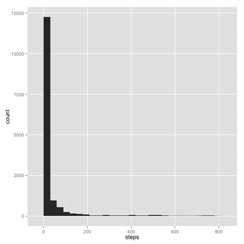
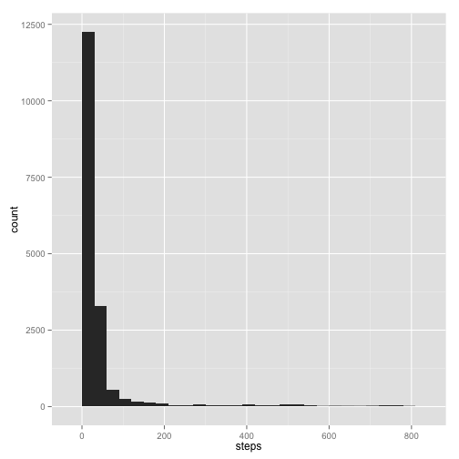
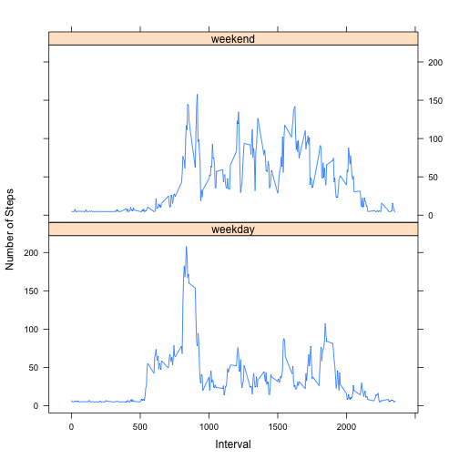

# Reproducible Research: Peer Assessment 1


## Loading and preprocessing the data


```r
library(ggplot2)
setwd("~/Documents/Aginity/classes/reproducible_research")
f <- 'assignment_1/RepData_PeerAssessment1/activity.csv'
df <- read.csv(f)
df$date=as.Date(df$date)
```

## What is mean total number of steps taken per day?


```r
qplot(steps, data=df, geom="histogram", binwidth=30)
```

 

```r
mean_steps <- mean(df$steps, na.rm=TRUE)
median_steps <- median(df$steps, na.rm=TRUE)
```
**The mean number of daily steps is 37.3826.**
**The median number of daily steps is 0.**


## What is the average daily activity pattern?


```r
# get the mean steps by interval
step_agg <- aggregate(df$steps, by=list(df$interval), FUN=mean, na.rm=TRUE)
colnames(step_agg) <- c("interval", "mean_steps")

ggplot(step_agg, aes(interval, mean_steps)) + geom_line() 
```

 

```r
max_steps <- max(step_agg$mean_steps)
interval_with_max_steps <- step_agg[step_agg$mean_steps == max_steps, 1]
```

**The interval with the maximum number of steps (averaged across all days) is 835.**

## Imputing missing values

```r
rows_with_na <- sum(!complete.cases(df))

# impute missing to the daily mean
daily_means <- aggregate(df$steps, by=list(df$date), FUN=mean, na.rm=TRUE)
colnames(daily_means) <- c("date", "daily_mean")

# however there are 8 missing days, so first impute those to the overall mean
daily_means$daily_mean[is.na(daily_means$daily_mean)] <- mean(df$steps, na.rm=TRUE)

# line up everything in a single dataframe
df2 <- merge(x=df, y=daily_means, by="date", all.x=TRUE)

# replace all of the NA steps with their daily_mean
df2$steps[is.na(df2$steps)] <- df2$daily_mean[is.na(df2$steps)]

# give the same structure as the original df
new_df <- df2[,c(2,1,3)]
```
**The number of rows that have NA values is 2304. Only 'steps' has NA values.**


```r
qplot(steps, data=new_df, geom="histogram", binwidth=30)
```

 

```r
new_mean_steps <- mean(new_df$steps, na.rm=TRUE)
new_median_steps <- median(new_df$steps, na.rm=TRUE)
```
**After imputation, the mean number of daily steps is 37.3826.**
**After imputation, the median number of daily steps is 0.**


## Are there differences in activity patterns between weekdays and weekends?

```r
# add the day category of weekday or weekend
day_cat <- function(d) { ifelse(sum(!is.na(match(c("Saturday", "Sunday"), weekdays(d))))==1,"weekend", "weekday") }
new_df$day_cat <- sapply(new_df$date, FUN=day_cat)

new_step_agg <- aggregate(new_df$steps, by=list(new_df$interval, new_df$day_cat), FUN=mean, na.rm=TRUE)
colnames(new_step_agg) <- c("interval", "day_cat", "mean_steps")

library(lattice)
xyplot(mean_steps ~ interval | day_cat, data = new_step_agg, type='l', layout = c(1,2), xlab="Interval", ylab="Number of Steps")
```

 


